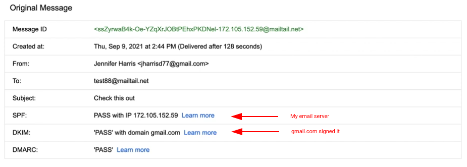

# gmailspoofer

Spoof gmail emails by sending through your own SMTP.

## What is gmailspoofer ?

*gmailspoofer* allows your to send emails through your server that are signed by GMail.  This is the code from my post [hacking gmail online](https://emailhacking.net/posts/hacking-gmail-online).

<!--  -->
<p align="center">
<kbd>

</kbd>
<br> Example 1.  Email is sent through source server and gmail signs the email. ( <a href="https://youtu.be/e_cp2s5miTI">Example video</a> )
</p>

## Limitations

Leveraging Google's domain reputation isn't enough to get into the inbox, you also have to have an IP with some level of reputation.  So, building a new VPS and trying to inject emails isn't likely going to result in emails inboxing (at least not for long).

However, leveraging a third party SMTP or pre-warmed server will result in consisten inboxing.  It is interesting to note that GMail's inbox placement algorithm is a mixture of both IP and domain reputation.  This method utilized GMail's own reputation, however you are still stuck with the IP reputation.

## Installation

- Download this repository
```
git clone https://github.com/emailhacking/gmailspoofer
```

- Install the dependencies
```
sudo pip3 install -r requirements.txt
```
> Python3 is required (Python 3.6.9 was used)
## Usage

Please watch the [setup video](https://youtu.be/e_cp2s5miTI).  It explains exactly how to set this up.  If you've never setup relaying on Postfix, this video explains everything you need.

1. You will need 1 gmail account to send the first email from.

2. You will need access to an SMTP server.  I used [Mail-In-A-Box](https://mailinabox.email/) and hosted my own on a VPS.
 - You will also need to setup relaying on your mail server from wherever you are running the code. Watch the video if you aren't sure how to do this.

3. Edit config.py to match your setup.
```
{
    'destination' : 'gmail.com', # This should always stay static
    'mail_from' : 'YOU@YOURSERVER.COM', # Original sender from YOUR domain (never gmail)
    'subscriber_email' : 'DESTINATION@gmail.com', # Destination email, regardless of raw_email header
    'server' : {
        'ip' : 'SMTP_IP', # IP or Domain of sending mail server
        'port' : 25,
        'starttls': True,
    },
    'raw_email': """ PASTE YOUR RAW SOURCE STARTING WITH Received: from """,
}
```

## Contact me

You can reach me at matt@emailhacking.net or (412) 960-2966.
